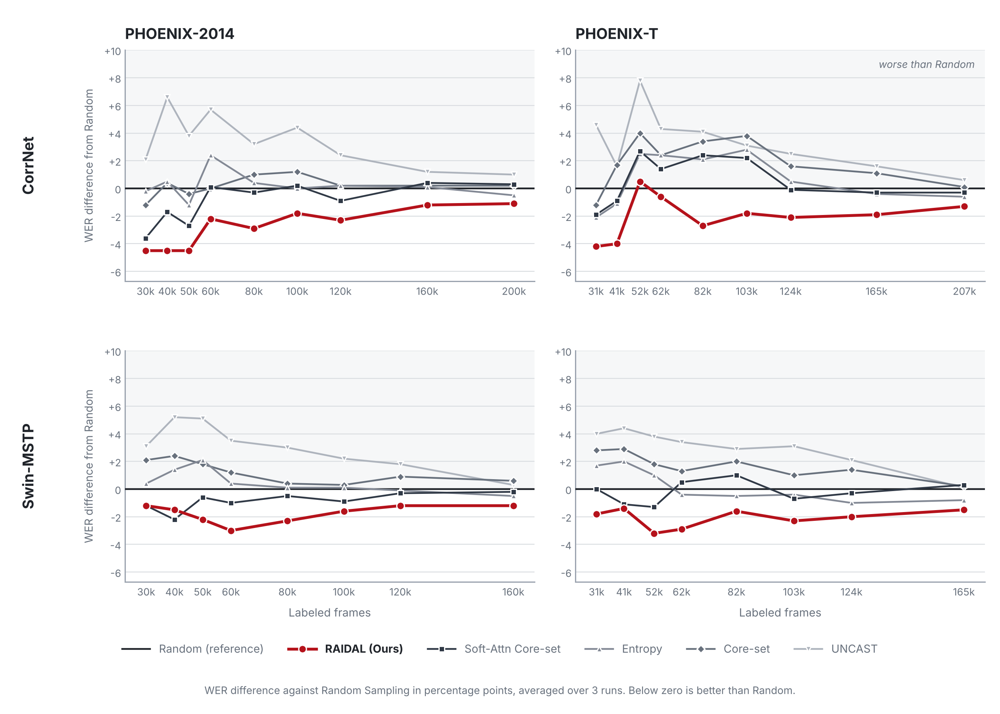
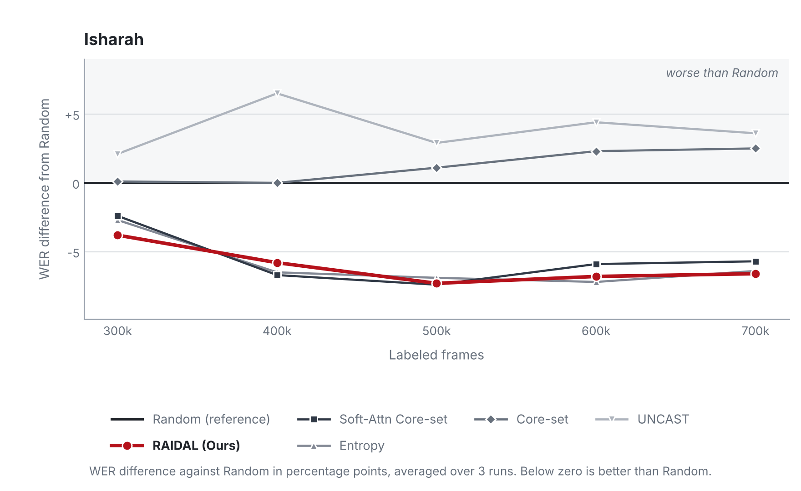

# RAIDAL: Redundancy-Aware Information Density Active Learning for CTC-Based Continuous Sign Language Recognition

[](https://bmvc2026.bmva.org/)
[](https://arxiv.org/abs/2609.06843)
[](LICENSE)

Official implementation of the **BMVC 2026** paper *[RAIDAL: Redundancy-Aware Information Density Active Learning for CTC-Based Continuous Sign Language Recognition](https://arxiv.org/abs/2609.06843)*.

**Annotating sign language video is expensive, often taking 40 to 80 minutes of expert work per minute of footage. RAIDAL picks which videos are worth that effort by asking the CTC decoder which frames support the predicted gloss sequence, and scores only those.**


## The problem

Continuous sign language recognition involves reading an unsegmented video and producing the gloss sequence that it contains, without ever being told where one sign ends and the next begins. The model has to recover that alignment on its own, from footage where real sign executions sit alongside rest poses, irregular pauses, sign like motion that carries no lexical meaning, and long stretches of temporally redundant frames.

Standard active learning acquisition functions score the whole video. But under weak alignment this can be a liability, because timesteps unrelated to the decoded gloss sequence still move the score, and the model's estimate of how informative a video is gets distorted.

## The idea

CSLR models already contain a component that links predicted glosses back to specific frames, and it is usually thrown away after inference. The CTC decoder emits each gloss as a sharp activation at one or a few timesteps, with blank almost everywhere else, so its alignment peaks mark where the model localizes its own predictions. RAIDAL reuses those peaks at zero additional labeling cost.

1. **Decode and keep alignment peaks.** Run the CTC decoder over the unlabeled video and recover the alignment peaks of the top decoded hypotheses.
2. **Expand peaks into a Temporal Region of Interest.** Grow each peak by a small temporal radius and merge the resulting windows. In our experiments this keeps roughly 20% to 40% of the original frames in the PHOENIX datasets using CorrNet.
3. **Measure novelty against the labeled pool.** Score only the retained features by their distance to the nearest labeled features, then normalize by the raw video length, since annotation is still paid on the whole video.

Selection is greedy, so once a video is acquired its retained features join the reference pool before the next candidate is scored. The peaks are used purely as model derived temporal anchors and are not estimates of where each sign physically begins and ends.

## Results

Across three datasets and two architectures, RAIDAL gives its strongest data efficiency gains in large vocabulary, budget limited settings, which is exactly where annotation effort hurts most.

The plot below reports each method as its WER difference from Random Sampling, so Random is the zero line and anything below it beats picking videos at random. WER is an error metric, so lower values indicate better performance.

<picture>
  <source media="(prefers-color-scheme: dark)" srcset="docs/assets/results_dark.png">
  
</picture>

All four panels share one vertical axis, so the flatter Swin-MSTP row is a real finding rather than a scaling artifact. The gaps are smaller on that backbone, and RAIDAL still holds the lowest curve in every setting.

Two findings are worth calling out. Entropy, Core-set and UNCAST all end up worse than plain Random Sampling on both PHOENIX datasets, which is the band of curves sitting above zero, showing that standard active learning strategies do not transfer reliably to this task. And Soft Attention Core-set, which also works at the timestep level but weights frames softly by their non-blank probability instead of filtering them, still trails RAIDAL. Therefore, filtering out frames by probability weighting does not appear to be enough, and explicitly restricting which timesteps are allowed to influence the score carries additional value.

The full results, significance tests and per-budget WER scores for each method are available in the paper.


### In Isharah, the gap against some competing methods narrows.

<picture>
  <source media="(prefers-color-scheme: dark)" srcset="docs/assets/isharah_dark.png">
  
</picture>

RAIDAL still comes out ahead on Isharah overall, and its advantage over Random, Core-set and UNCAST is statistically significant. Its difference from Entropy and from Soft Attention Core-set is not statistically significant, which is the three curves running together in the plot.

Isharah pairs a smaller vocabulary with much larger budgets, so every method already covers more than 90% of the 680 glosses by the first 300k frames. With most of the vocabulary already in hand, choosing which videos get picked next becomes less consequential, and the three strongest methods end up close together. The paper works through this in more detail.

## **What this buys you.** 

On CorrNet with PHOENIX-T, RAIDAL reaches both the 45% and the 40% WER targets a full annotation cycle before Random Sampling. At those budgets one cycle is 20,700 frames, which is about 13.8 minutes of footage left unannotated, or an estimated **9.2 to 18.4 hours of expert labor avoided**.

## Quickstart instructions

```text
1. Build the Docker container with the automated script

2. Download and preprocess your dataset of choice (PHOENIX-14, PHOENIX-T, Isharah-1000)

3. Run your experiment
```

| Doc | What it covers |
|---|---|
| [Environment setup](docs/SETUP.md) | Docker image, conda environment, `ctcdecode` |
| [Dataset preparation](docs/DATASETS.md) | PHOENIX-2014, PHOENIX-T, Isharah, preprocessing, LMDB |
| [Running experiments](docs/RUNNING.md) | Every flag, the shared start workflow, reproducing the paper |

## Implemented strategies

Every acquisition function in the paper is implemented in this repository and can be selected with the `-s` flag.

| `-s` | Method |
|---|---|
| `raidal` | **RAIDAL**, the proposed method |
| `random` | Random Sampling |
| `entropy` | Mean per frame entropy |
| `uncast` | UNCAST sequence-level CTC uncertainty |
| `global-pooled-coreset` | Core-set over one pooled embedding per video |
| `soft-attention-coreset` | Timestep-level Core-set weighted by non-blank probability |
| `ctc-badge` | CTC BADGE gradient embeddings with k-means++ selection |

The ablations are available too, covering decoder based filtering (`unfiltered-raidal`), the same filter applied to Entropy (`raidal-E`) and to CTC BADGE (`raidal-ctc-badge`), the number of decoded hypotheses (`raidal-K1`, `raidal-K2`, `raidal-K5`) and the temporal expansion radius (`raidal-R0` through `raidal-R4`). See [Running experiments](docs/RUNNING.md) for the full list.

## Repository layout

```text
RAIDAL/
├── README.md
├── LICENSE
├── docs/assets/
├── docs/
│   ├── SETUP.md
│   ├── DATASETS.md
│   └── RUNNING.md
├── CorrNet/
└── Swin-MSTP/
```

`CorrNet/` contains the CorrNet training and active learning pipeline used for the main experiments in the paper, while `Swin-MSTP/` contains the corresponding implementation for the Transformer experiments. The shared documentation is kept under `docs/` so that setup, dataset preparation, and experiment reproduction remain in one place instead of being duplicated for each architecture. The documentation provides examples using CorrNet, but the exact same commands can be used with Swin-MSTP.

## Citation

```bibtex
@inproceedings{dinizaugusto2026raidal,
  title={RAIDAL: Redundancy-Aware Information Density Active Learning for CTC-Based Continuous Sign Language Recognition},
  author={Diniz Augusto, Rafael A. and Oliveira, Gabriel L. and Nascimento, Erickson R.},
  booktitle={British Machine Vision Conference},
  year={2026}
}
```

## Acknowledgments

The CorrNet experiments build on the [public CorrNet implementation](https://github.com/hulianyuyy/CorrNet), while the Swin-MSTP experiments build on the [public Swin MSTP implementation](https://github.com/snalyami/Swin-MSTP), so please cite their papers when using either implementation.

## Questions

If you have any questions, feel free to open up an issue!
